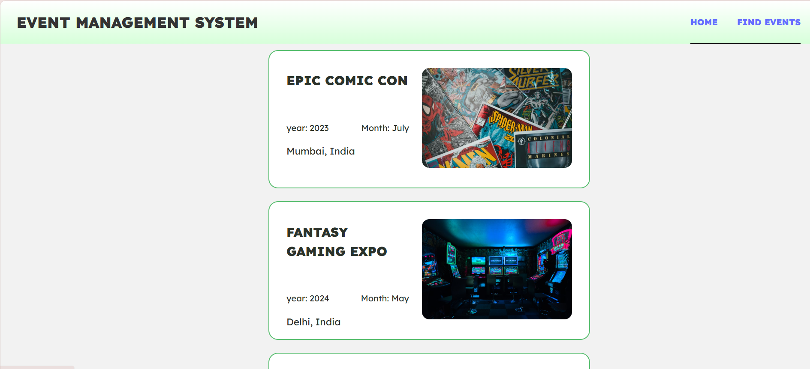
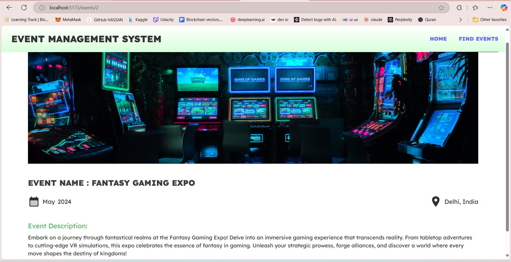

### **Event Management System 🎉**

A full-stack application to streamline event organization and coordination.  

## **Features**
- **User Authentication**: Secure login and registration.  
- **Dynamic Event Creation**: Create and manage events with ease.  
- **Real-Time Updates**: Track event changes and notifications.  
- **Responsive Design**: Optimized for desktop and mobile use.  

## **Technologies Used**
- **Frontend**: ReactJS, TailwindCSS  
- **Backend**: Node.js, Express.js  
- **Database**: MongoDB  

## **How to Use**
1. Clone this repository.  
2. Install dependencies using `npm install`.  
3. Start the server using `npm start`.  
4. Navigate to `http://localhost:5173/` to use the app.  

## **Future Enhancements**
- Calendar integration for better scheduling.  
- Social media sharing for event promotion.  
- Advanced analytics for event insights.  
## Main Page

## Event Details Page

